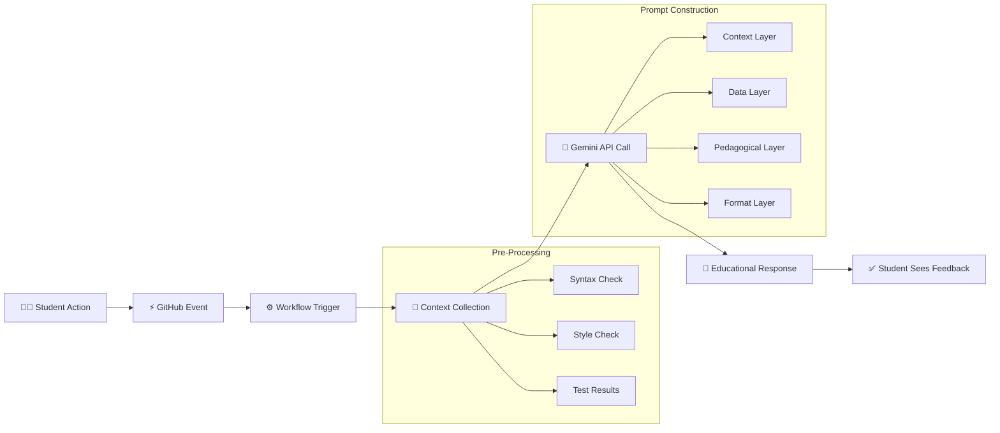

# Educational AI Workflow Architecture

> **GitHub Actions + Gemini CLI + Thoughtful Prompts = Powerful Educational Automation**

---

## System Overview

This architecture demonstrates how to build automated, pedagogically-sound AI feedback for student code submissions using simple, transparent components.

```
┌─────────────────────────────────────────────────────────────────────────────────────┐
│                         EDUCATIONAL AI WORKFLOW PIPELINE                            │
└─────────────────────────────────────────────────────────────────────────────────────┘

  ┌──────────┐    ┌──────────┐    ┌──────────┐    ┌──────────┐    ┌──────────┐    ┌──────────┐    ┌──────────┐
  │    1     │    │    2     │    │    3     │    │    4     │    │    5     │    │    6     │    │    7     │
  │  👩‍💻      │───▶│  ⚡      │───▶│  ⚙️      │───▶│  🔧      │───▶│  🤖      │───▶│  📝      │───▶│  ✅      │
  │ Student  │    │ GitHub   │    │ Actions  │    │  Pre-    │    │ Gemini   │    │Educational│   │ Student  │
  │ Action   │    │ Event    │    │ Workflow │    │ Process  │    │ API      │    │ Response │    │ Feedback │
  └──────────┘    └──────────┘    └──────────┘    └──────────┘    └──────────┘    └──────────┘    └──────────┘
```

---

## Component Details

### 1. 👩‍💻 Student Action

**Purpose:** The entry point that triggers the entire feedback loop.

| Aspect | Description |
|--------|-------------|
| **What happens** | Student opens a Pull Request with code changes |
| **Trigger types** | New PR opened, existing PR updated, PR reopened |
| **File filtering** | Can be limited to specific file types (*.py, *.cpp, etc.) |

**Detailed explanation:**

The workflow begins when a student pushes code:

- Opens new PR with assignment code
- Updates existing PR with fixes
- Triggers on specific file types (*.py, *.cpp, etc.)

This is the entry point for the entire feedback loop. The student doesn't need to do anything special—just normal Git workflow.

---

### 2. ⚡ GitHub Event

**Purpose:** GitHub detects the change and fires an event.

| Aspect | Description |
|--------|-------------|
| **What happens** | GitHub's event system captures the action |
| **Event types** | `opened`, `synchronize`, `reopened` |
| **Metadata included** | User info, files changed, branch name, diff |

**Detailed explanation:**

GitHub's event system captures the action:

- Event types: opened, synchronize, reopened
- Contains metadata: user, files changed, branch
- Triggers configured workflow runners

Events are the bridge between student actions and automation. They carry all the context needed for intelligent feedback.

---

### 3. ⚙️ Actions Workflow

**Purpose:** GitHub Actions runner starts the workflow.

| Aspect | Description |
|--------|-------------|
| **What happens** | The YAML workflow file defines the automation |
| **Runs on** | `ubuntu-latest` (free tier available) |
| **Capabilities** | Checkout code, run scripts, access GitHub context |

**Detailed explanation:**

The workflow YAML defines what happens:

- Runs on ubuntu-latest (free tier)
- Checks out student's code
- Has access to GitHub context variables
- Orchestrates all subsequent steps

This is your "recipe" for automated feedback. Every step is visible and modifiable.

---

### 4. 🔧 Pre-Processing

**Purpose:** Run linters, compilers, and analysis tools.

| Aspect | Description |
|--------|-------------|
| **What happens** | Real tools provide concrete data for AI |
| **Tools used** | `python -m py_compile`, `flake8`, `pytest`, custom scripts |
| **Why important** | Hybrid approach (tools + AI) is more reliable than AI-only |

**Detailed explanation:**

Real tools provide concrete data for AI:

- `python -m py_compile` → syntax errors
- `flake8/pylint` → style issues
- `pytest` → test results
- Custom scripts → metrics

The hybrid approach (tools + AI) is more reliable than AI-only analysis. Tools give facts; AI interprets them pedagogically.

---

### 5. 🤖 Gemini API

**Purpose:** AI processes code with educational prompt.

| Aspect | Description |
|--------|-------------|
| **What happens** | Carefully crafted prompt sent to Gemini |
| **Prompt layers** | Context, Data, Pedagogical, Format |
| **Key insight** | Prompt engineering is where pedagogy meets AI |

**Detailed explanation:**

The AI receives a carefully crafted prompt with four layers:

- **Context**: Student info, course week, objectives
- **Data**: Tool outputs, file changes, diff
- **Instructions**: Teaching focus, tone, level
- **Format**: Response structure template

The prompt engineering is where pedagogy meets AI. This is the most customizable part of the system.

---

### 6. 📝 Educational Response

**Purpose:** Structured feedback focused on learning.

| Aspect | Description |
|--------|-------------|
| **What happens** | AI generates pedagogically-sound feedback |
| **Structure** | What's working, Learning opportunities, Quick fixes |
| **Philosophy** | Encourages learning, doesn't just find bugs |

**Detailed explanation:**

AI generates pedagogically-sound feedback:

- 🎉 **What's Working Well**: Specific positives
- 📚 **Learning Opportunities**: Explanations + examples
- 🔧 **Quick Fixes**: Actionable improvements

The response encourages learning rather than just pointing out errors. It builds confidence while maintaining standards.

---

### 7. ✅ Student Sees Feedback

**Purpose:** Comment appears on their Pull Request.

| Aspect | Description |
|--------|-------------|
| **What happens** | Feedback delivered where students work |
| **Format** | Markdown with emojis, links to resources |
| **Timing** | Appears within seconds of PR update |

**Detailed explanation:**

Feedback delivered where students work:

- Appears as PR comment within seconds
- Formatted with markdown/emojis
- Links to relevant resources
- Invites iteration and questions

This closes the feedback loop, enabling rapid improvement. Students can immediately act on suggestions and push updates.

---

## Key Design Principles

### 🔍 Transparency Over Magic

| Principle | Implementation |
|-----------|----------------|
| Students understand what's happening | AI reviews their code (no hidden processes) |
| Instructors can see everything | Every prompt is visible and editable |
| No black boxes | Open source tools, standard formats |

### 🎓 Education-First AI

| Principle | Implementation |
|-----------|----------------|
| AI teaches concepts | Doesn't just find bugs |
| Encourages learning | Through explanation, not criticism |
| Builds confidence | While maintaining standards |

### 🚀 Minimal Viable Infrastructure

| Principle | Implementation |
|-----------|----------------|
| Uses existing tools | GitHub, Google AI (Gemini) |
| No servers to maintain | Runs on GitHub Actions |
| Scales effortlessly | Same setup for 1 to 1000 students |

---

## The Formula

```
┌─────────────────┐   ┌─────────────────┐   ┌─────────────────┐   ┌─────────────────────────────┐
│ GitHub Actions  │ + │   Gemini CLI    │ + │Thoughtful Prompts│ = │Powerful Educational Automation│
└─────────────────┘   └─────────────────┘   └─────────────────┘   └─────────────────────────────┘
```

---

## Data Flow Diagram



---

## Quick Reference Table

| Step | Component | Input | Output | Key Action |
|------|-----------|-------|--------|------------|
| 1 | Student Action | Code changes | Git push/PR | Triggers workflow |
| 2 | GitHub Event | PR metadata | Event payload | Captures context |
| 3 | Actions Workflow | Event payload | Job execution | Orchestrates steps |
| 4 | Pre-Processing | Source code | Tool reports | Generates concrete data |
| 5 | Gemini API | Prompt + data | AI response | Pedagogical analysis |
| 6 | Educational Response | AI output | Formatted feedback | Structures for learning |
| 7 | Student Feedback | Formatted feedback | PR comment | Closes the loop |

---

## Getting Started

1. **Create workflow file**: `.github/workflows/ai-assistant.yml`
2. **Add API key**: Repository Settings → Secrets → `GEMINI_API_KEY`
3. **Customize prompt**: Adjust context, pedagogical instructions, format
4. **Test with sample PR**: Open a PR with intentional issues to verify
5. **Iterate**: Refine prompts based on feedback quality

---

## Related Resources

- [Prompt Engineering Cheatsheet](./prompt_cheatsheet.md) - The 4-layer structure in detail
- [Starter Templates](./templates/) - Ready-to-use workflow files
- [Original Developer's Guide](./Developers_Guide__Building_Educational_AI_Workflows.pdf) - Full documentation
